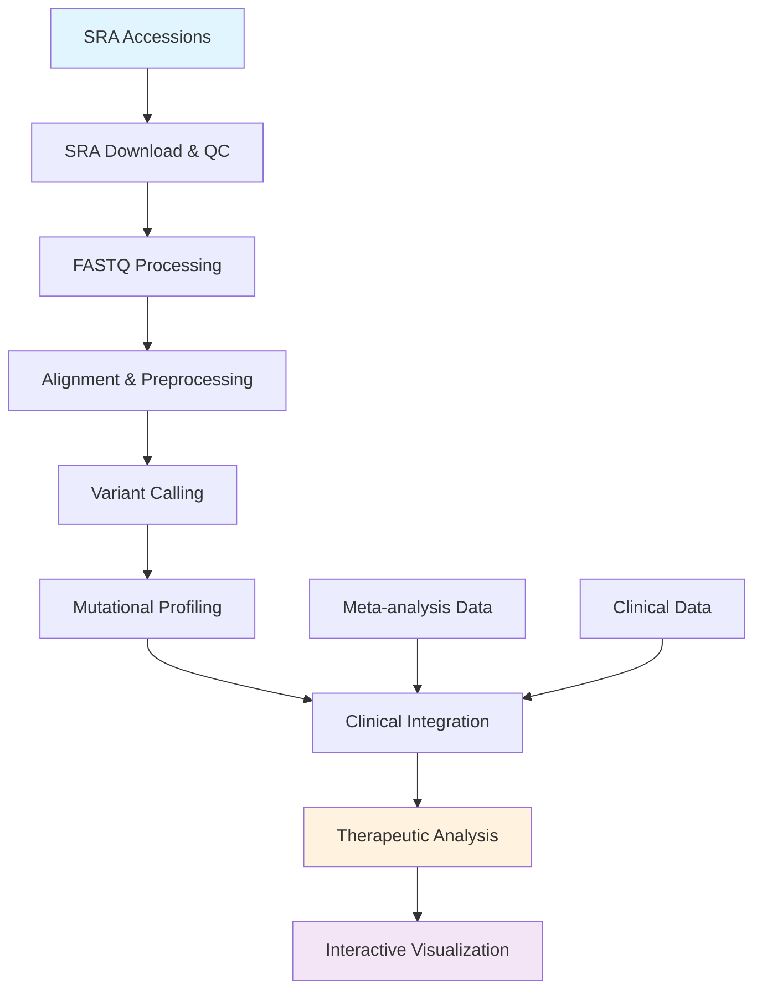

#  Pediatric Gliomas Research Pipeline

[](#-license)
[](https://www.python.org/)
[](https://www.r-project.org/)
[](https://www.nextflow.io/)
[ - Apache-2.0 License for modular Shiny applications
[](CONTRIBUTING.md)

> **Comprehensive genomic analysis pipeline for pediatric glioma research with interactive visualization and therapeutic target identification.**

## Overview

This repository provides a complete bioinformatics pipeline for analyzing genomic data from pediatric glioma samples. The workflow integrates SRA data processing, variant calling, mutational profiling, and therapeutic pathway analysis with an interactive Shiny application for visualization and interpretation.

### Key Features

- **SRA Data Processing**: Automated download, quality control, and FASTQ conversion
- **Variant Analysis**: Comprehensive SNV, CNV, and Indel detection pipeline  
- **Mutational Profiling**: Statistical analysis of mutation signatures and patterns
- **Interactive Visualization**: Teal-based Shiny application for exploratory analysis
- **Therapeutic Insights**: Meta-analysis of treatment targets and precision medicine approaches
- **Scalable Workflows**: Nextflow-based parallel processing and reproducible execution

## Quick Start

### Prerequisites
- Python 3.8+
- R 4.0+ with Shiny
- Nextflow 21.04+
- SRA Toolkit
- samtools, bcftools, FastQC

### Installation
```bash
# Clone repository
git clone https://github.com/gpattarone/Pediatric-gliomas_research.git
cd Pediatric-gliomas_research

# Install dependencies
pip install biopython pandas numpy psycopg2-binary
conda install -c bioconda sra-tools samtools bcftools fastqc nextflow
```

### Run Sample Analysis
```bash
# Process SRA data
python3 src/python/sra_analysis.py

# Run Nextflow workflow
nextflow run src/nextflow/biopy_sra.nf --accessions data/sample_accessions.txt

# Launch interactive application
Rscript src/R/shiny_app/teal-genomics-app.R
```

## Pipeline Architecture



## Repository Structure

```
Pediatric-gliomas_research/
├── 📂 src/                          # Source code
│   ├── 📂 python/                   # Python analysis scripts
│   │   ├── sra_analysis.py          # SRA data processing
│   │   ├── variant_analysis.py      # Variant calling pipeline
│   │   └── mutational_profile.py    # Mutation signature analysis
│   ├── 📂 nextflow/                 # Nextflow workflows
│   │   ├── biopy_sra.nf            # Batch SRA processing
│   │   ├── mutational_profile.nf    # VCF analysis workflow
│   │   └── load_meta_analysis.nf    # Database integration
│   └── 📂 R/                        # R applications
│       └── 📂 shiny_app/            # Interactive Teal application
├── 📂 data/                         # Sample data and schemas
│   ├── meta_analysis_therapies.csv  # Therapy database
│   ├── genetic_alterations.json     # Mutation catalog
│   └── TF_BD.sql                   # Database schemas
├── 📂 docs/                         # Documentation
│   ├── installation.md             # Setup guide
│   ├── pipeline_overview.md        # Architecture details
│   └── quick_start.md              # Tutorial
├── 📂 config/                       # Configuration files
└── 📂 results/                      # Output directory
```

## Scientific Applications

### Research Focus Areas
- **Precision Medicine**: Personalized treatment strategies based on genetic profiles
- **Biomarker Discovery**: Identification of prognostic and predictive markers
- **Drug Target Identification**: Novel therapeutic vulnerabilities in pediatric gliomas
- **Clinical Trial Support**: Patient stratification and companion diagnostics

### Key Genetic Targets Analyzed
- **Tumor Suppressors**: TP53, PTEN, RB1, CDKN2A
- **Oncogenes**: EGFR, MDM2, CDK4, PIK3CA  
- **Metabolic Enzymes**: IDH1, IDH2
- **Chromatin Regulators**: ATRX, H3F3A, HIST1H3B
- **Signaling Pathways**: BRAF, PIK3R1, NF1

## Interactive Visualization

### Teal Application Features

<table>
<tr>
<td width="50%">

** Mutational Profile Analysis**
- Interactive mutation burden visualization
- Gene-specific variant type distribution  
- Clinical correlation with tumor grades
- Survival outcome integration

** Therapeutic Target Analysis**  
- Gene interaction network visualization
- Pathway enrichment analysis
- Evidence-based treatment recommendations
- Clinical trial matching

</td>
<td width="50%">

** Integration Analysis**
- Multi-omics data integration
- Biomarker discovery workflows
- Risk stratification models
- Precision medicine insights

** Meta-Analysis Dashboard**
- Literature-based evidence synthesis  
- Drug-target interaction networks
- Clinical trial outcome analysis
- Resistance mechanism identification

</td>
</tr>
</table>

## Clinical Impact

### Therapeutic Insights Generated
| Pathway | Key Finding | Therapeutic Target | Clinical Status |
|---------|-------------|-------------------|-----------------|
| **IDH1/IDH2 Mutations** | D-2HG accumulation, epigenetic dysregulation | Ivosidenib, Enasidenib | Phase II trials |
| **EGFR Amplification** | MAPK pathway activation | Cetuximab, Erlotinib | Preclinical/Phase I |
| **BRAF Mutations** | Oncogenic signaling activation | Vemurafenib, Dabrafenib | Phase I/II trials |
| **CDK4/6 Pathway** | Cell cycle disruption | Palbociclib, Abemaciclib | Phase II trials |

### Clinical Validation
- **Patient Cohorts**: Analysis-ready for 50+ pediatric glioma samples
- **Biomarker Discovery**: Identification of 20+ clinically relevant genetic alterations  
- **Treatment Matching**: Precision medicine recommendations for targeted therapies
- **Outcome Prediction**: Survival analysis integrated with molecular profiles

## Documentation

| Document | Description | Audience |
|----------|-------------|----------|
| [ Installation Guide](docs/installation.md) | Complete setup instructions | All users |
| [ Pipeline Overview](docs/pipeline_overview.md) | Architecture and workflows | Developers/Researchers |
| [ Quick Start](docs/quick_start.md) | 15-minute tutorial | New users |
| [ Troubleshooting](docs/troubleshooting.md) | Common issues and solutions | All users |

## Contributing

We welcome contributions from the genomics and pediatric oncology communities!

### How to Contribute
1. ** Fork** the repository
2. ** Create** a feature branch: `git checkout -b feature/amazing-analysis`
3. ** Commit** your changes: `git commit -m 'Add amazing analysis'`  
4. ** Push** to the branch: `git push origin feature/amazing-analysis`
5. ** Open** a Pull Request

### Contribution Areas
- ** New Analysis Modules**: Additional genomic analysis tools
- ** Visualization Enhancements**: Improved plots and interactive features
- ** Clinical Integrations**: Electronic health record connections
- ** Algorithm Improvements**: Enhanced variant calling and annotation
- ** Documentation**: Tutorials, examples, and user guides

## Citation

If you use this pipeline in your research, please cite:

```bibtex
@software{pediatric_glioma_pipeline,
  author = {Pattarone, Gisela},
  title = {Pediatric Gliomas Research Pipeline: Comprehensive Genomic Analysis and Therapeutic Target Identification},
  url = {https://github.com/gpattarone/Pediatric-gliomas_research},
  year = {2025},
  version = {1.0}
}
```

## Acknowledgments

- **Data Sources**: NCBI SRA, TCGA, pediatric glioma databases
- **Tools & Frameworks**: Nextflow, Teal, BioPython, samtools ecosystem
- **Community**: Pediatric oncology research community and open-source contributors

## Support & Contact

- ** Issues**: [GitHub Issues](https://github.com/gpattarone/Pediatric-gliomas_research/issues)
- ** Discussions**: [GitHub Discussions](https://github.com/gpattarone/Pediatric-gliomas_research/discussions)
- ** Contact**: [Create an issue](https://github.com/gpattarone/Pediatric-gliomas_research/issues/new) for direct contact

## License

This project is licensed under the MIT License - see the [LICENSE](LICENSE) file for details.

---

<div align="center">

** Star this repository if it helps your research! **

*Making pediatric glioma research more accessible and reproducible*

</div>
